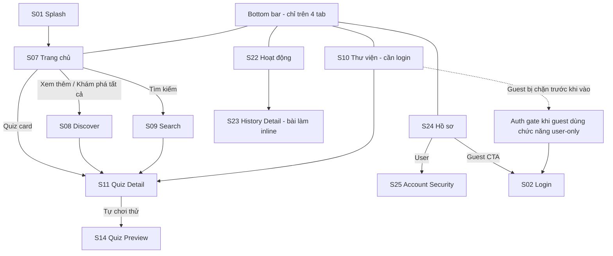
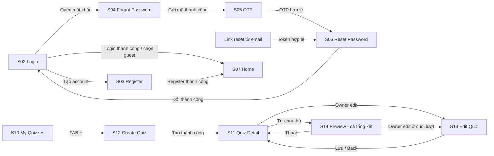
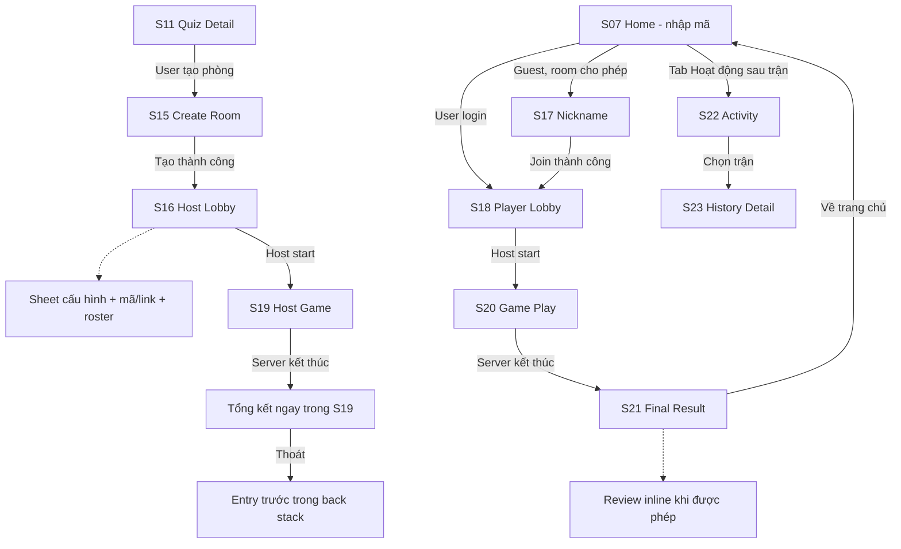

# MyQuizzApp — Hoa tiêu trải nghiệm cho designer

Ứng dụng Android tạo quiz, mở phòng chơi realtime, tham gia với tài khoản hoặc tư cách khách, chơi thử và xem lại lịch sử. Tài liệu này giúp designer **đi qua giao diện hiện có trước khi dựng Figma**, không phải checklist nghiệm thu hay cam kết các backend gate đã hoàn tất.

**Bắt đầu:** chuẩn bị fixture ở mục 2 → làm 6 hành trình ở mục 5 → tick bảng bao phủ ở mục 7 → bổ sung dialog/biến thể ở mục 6. Nếu chỉ có thời gian ngắn, đi J1–J3 trước, sau đó hẹn dev hỗ trợ J4–J6.

> Audit code/navigation trên `main` tại `35c186b0423d90942ab985d71193cfd0195bfc4e`. Có **25 route màn hình**; bộ hành trình được đối chiếu đủ 25/25 về mặt kế hoạch, **chưa phải designer đã chạy hết**. Backend deployment và APK thực tế cần dev xác nhận. README là tài liệu công khai trên main; ghi chú dev/test chi tiết nằm ở nhánh `docs`.

## 1. Quy ước để không thiết kế nhầm flow

- **Guest** là người chưa login; **user** là account đăng nhập. **Host/Player là vai trò trong một phòng**, không phải hai loại tài khoản riêng. Host cần login; Player có thể là user hoặc guest nếu config phòng cho phép.
- Bottom bar chỉ có **Trang chủ · Thư viện · Hoạt động · Hồ sơ**. Chỉ hiện ở đúng 4 tab này; Search, Detail, editor, lobby, game và các màn con ẩn bottom bar.
- **Nhập mã phòng là card trên Home**, không có màn/tab “Tham gia” riêng. Mã gồm 6 ký tự; user vào PlayerLobby trực tiếp, guest đi qua GuestNickname.
- **Thư viện = Quiz của tôi** (`MyQuizzes`), không phải kho public thứ hai. Guest bấm Thư viện/tạo phòng sẽ gặp auth gate trước khi vào chức năng đó.
- **Tự chơi thử** (`QuizPreview`) chạy local, không room/socket/history; điểm ước tính. **Solo** trong CreateRoom là mode của trận có server, lobby và kết quả thật.
- **Review/bài làm không có route riêng**: review Player mở rộng trong FinalResult; bài làm lịch sử nằm trong GameHistoryDetail; review Preview nằm trong tổng kết Preview. Không mặc định dựng thành 3 màn điều hướng mới.
- **Profile edit/avatar là dialog**, config HostLobby là bottom sheet. Tổng kết Host là state của HostGame, không chuyển sang FinalResult dành cho Player.
- `AuthGraph` và `MainGraph` chỉ là nhóm navigation, không phải màn. Android photo picker/Google credential UI là giao diện hệ thống, không tính trong 25 màn tự thiết kế.

## 2. Chuẩn bị buổi walkthrough

Nhờ dev cung cấp APK debug đúng revision và các fixture dưới đây; **không cần tự build hoặc sửa API**. Nếu build bằng Android Studio, project Gradle nằm ở gốc repo; package app là `android.kma.myquizzapp`.

| Cần chuẩn bị | Mục đích / lưu ý |
| --- | --- |
| 2 thiết bị Android hoặc 1 Android + emulator hoạt động | Một Host và một Player. Muốn đối chiếu đồng thời user + guest cần client thứ ba, hoặc chơi hai lượt riêng. Web có thể giúp tạo/người chơi phòng, nhưng không thay việc mở UI Player/guest Android |
| Account local test A, email nhận OTP được | J2/J3/J6; biết password test. Account B/Google-only nếu có để xem biến thể, không dùng tài khoản cá nhân |
| Quiz public của người khác | Xem non-owner Detail/Preview và guest discovery; không thấy action owner |
| Quiz owner để test | Cover, ảnh câu hỏi, gợi ý/giải thích; đủ 4 loại: chọn 1/chọn nhiều/trả lời ngắn/trả lời dài; vài câu đủ thời gian thao tác |
| Quiz test được phép chỉnh sửa | J3 tạo/edit. Mở dialog xóa rồi hủy là đủ xem UI; không xóa quiz có lịch sử cần giữ |
| Room Classic ngắn, cho guest, review/reveal bật | J4 xem gameplay, FinalResult/review; ít nhất một Player tham gia |
| Room/cấu hình biến thể | Self-paced, lives, timer trận, leaderboard hidden/review disabled — cần dev hỗ trợ cho mục 6 |
| Account có trận Đã chơi và Đã tổ chức | J5 xem cả hai role, history detail + answers; account/guest mới chưa có lịch sử chỉ cho thấy empty state |

Ghi APK version/revision, thiết bị/OS, vai trò/account alias và room/quiz alias trong ghi chú Figma. Không đưa email thật, password, OTP, reset link/token, socket token hoặc dữ liệu người dùng thật vào frame công khai.

**Không phá dữ liệu để xem UI:** chỉ mở và hủy confirm xóa quiz/deactivate. Đổi/reset password chỉ trên account test được dev đồng ý. Các nhánh cleanup/fatal/ACK uncertainty cần fixture có kiểm soát hoặc preview/screenshot do dev cung cấp; không sửa token/DB và không gây lỗi trên backend đang phục vụ người thật.

## 3. Danh sách toàn bộ màn hiện tại

ID `Sxx` là mã đối chiếu README/Figma, không phải route trong app. Một màn có nhiều state vẫn chỉ có một ID.

| ID | Màn / route | Lối vào | Cần quan sát | Hành trình |
| --- | --- | --- | --- | --- |
| S01 | **Khởi động** · `Splash` | Mở app từ launcher | Logo + loading, tự vào Home | J1 |
| S02 | **Đăng nhập** · `Login` | CTA ở Home/Profile hoặc auth gate | Email/password, Google, chơi guest; sang Register/ForgotPassword | J2 |
| S03 | **Đăng ký** · `Register` | Login → Tạo tài khoản mới | Form đăng ký; thành công vào Home, không qua OTP đăng ký | J2 |
| S04 | **Quên mật khẩu** · `ForgotPassword` | Login → Quên mật khẩu | Nhập email và gửi mã; sang OTP | J2 |
| S05 | **Xác thực OTP** · `OtpVerification` | Gửi mã quên mật khẩu thành công | Nhập/xác thực mã, gửi lại/countdown; sang Reset bằng ticket hợp lệ | J2 |
| S06 | **Đặt lại mật khẩu** · `ResetPassword` | OTP hợp lệ hoặc reset link email | Form mật khẩu mới/xác nhận, ticket loading/expired/error; thành công về Login | J2 |
| S07 | **Trang chủ** · `Home` | Sau Splash; tab Trang chủ | Quiz sections, tìm kiếm, khám phá, ô nhập mã phòng, CTA guest | J1, J4 |
| S08 | **Khám phá** · `Discover` | Home → Xem thêm ở section hoặc Khám phá tất cả | Danh sách + filter/sort/paging; mở QuizDetail | J1 |
| S09 | **Tìm kiếm** · `Search` | Home → icon tìm kiếm | Keyword/submit, kết quả + paging/empty/error; mở QuizDetail | J1 |
| S10 | **Thư viện / Quiz của tôi** · `MyQuizzes` | Tab Thư viện, cần login | Danh sách quiz của account, keyword/filter/sort; FAB tạo quiz | J3 |
| S11 | **Chi tiết quiz** · `QuizDetail` | Card từ Home/Discover/Search/Thư viện; sau tạo quiz | Thông tin/câu hỏi/ảnh; Preview, tạo phòng; sửa/xóa chỉ owner | J1, J3, J4 |
| S12 | **Tạo quiz** · `CreateQuiz` | Thư viện → FAB + | Metadata, public/private, ảnh, editor 4 loại câu; tạo xong sang Detail | J3 |
| S13 | **Chỉnh sửa quiz** · `EditQuiz` | Detail của owner → Chỉnh sửa; Preview owner ở cuối lượt | Form có dữ liệu sẵn, lưu/dirty-discard; quay Detail | J3 |
| S14 | **Tự chơi thử** · `QuizPreview` | QuizDetail → Tự chơi thử | Countdown/question/feedback/tổng kết/chơi lại trên một route, chạy local | J1, J3 |
| S15 | **Tạo phòng chơi** · `CreateRoom` | QuizDetail → Tạo phòng, cần login | Tên phòng, 5 mode + config theo mode; tạo thành công sang HostLobby | J4 |
| S16 | **Phòng chờ Host** · `HostLobby` | Tạo phòng thành công | Mã/link, roster, connection, sheet config, Start; sang HostGame | J4 |
| S17 | **Tên hiển thị guest** · `GuestNickname` | Home nhập mã phòng khi chưa login, room cho guest | Nhập nickname rồi join PlayerLobby; user login bỏ qua màn này | J4 |
| S18 | **Phòng chờ Player** · `PlayerLobby` | Home nhập mã khi login, hoặc GuestNickname join xong | Roster + connection, chờ Host start; sang GamePlay | J4 |
| S19 | **Điều khiển trận / Host Console** · `HostGame` | HostLobby → Bắt đầu | Classic: câu hỏi/timer/control/board; self-paced: dashboard; ended là state cùng màn | J4 |
| S20 | **Chơi / Player** · `GamePlay` | Host bắt đầu trận | Countdown, 4 kiểu input, submit/locked/results, pause, self-paced terminal/reconnect | J4 |
| S21 | **Kết quả Player** · `FinalResult` | GamePlay nhận kết thúc trận | Thành tích/board theo policy, thống kê, review inline, recovery; Về trang chủ | J4 |
| S22 | **Hoạt động** · `Activity` | Tab Hoạt động | User: Đã chơi/Đã tổ chức; guest: Đã chơi; load more, mở history detail | J1, J5 |
| S23 | **Chi tiết trận trong lịch sử** · `GameHistoryDetail` | Hoạt động → một trận | Summary, thành tích/board, Host stats, bài làm riêng Player và review-disabled | J5 |
| S24 | **Hồ sơ** · `Profile` | Tab Hồ sơ | Guest CTA; user info/edit dialog/avatar preview/logout, lối vào Security | J1, J6 |
| S25 | **Bảo mật tài khoản** · `AccountSecurity` | Hồ sơ user → Bảo mật tài khoản | Đổi password/deactivate cho local; Google-only explanation; confirm/cleanup states | J6 |

## 4. Bản đồ tương tác — Mermaid

GitHub hỗ trợ render các khối Mermaid dưới đây. Nếu trình xem chỉ hiện code, mở README trên GitHub hoặc công cụ Mermaid tương thích; đây là navigation map, không phải wireframe bố cục.

### 4.1. App shell và khám phá

Cạnh `---` của bottom bar biểu diễn khả năng đổi tab, không phải 4 bước điều hướng tuần tự. Cạnh nét đứt là điều kiện/khối UI, không phải màn mới.

### 4.2. Auth và tạo/chỉnh quiz

Reset link là lối vào bổ sung, không bắt buộc để bao phủ S06 nếu đã đi OTP. Manifest hiện khai báo HTTPS `myquizz.dpdns.org/reset-password`; mở link vào app còn phụ thuộc App Links trên thiết bị/domain, không giả định mọi link đều tự mở app.

### 4.3. Một phòng — hai trải nghiệm Host/Player

Hai nhánh gặp nhau ở **cùng room trên server**, không phải Host điều hướng sang màn Player. Mũi tên theo sự kiện không có nghĩa user tự bấm được ở mọi phase.

### 4.4. Back và trở về — các điểm designer cần giữ

- Đổi tab giữ state/tab stack; Back từ tab khác về Home, không lần lượt quay qua mọi tab đã bấm.
- Login/register thành công mở MainGraph/Home và bỏ auth flow. Không mặc định tự tiếp tục action bị auth gate chặn; sau login hãy thực hiện action lại.
- CreateQuiz lưu thành công thay editor bằng QuizDetail; Back từ Detail về Thư viện. EditQuiz lưu xong pop về Detail.
- Preview → owner Edit bỏ Preview khỏi stack; Back từ editor không mở lại lượt Preview vừa chơi.
- CreateRoom/HostLobby và PlayerLobby bị bỏ khỏi stack khi chuyển bước tương ứng; FinalResult thay GamePlay. Không vẽ Back quay về lobby/game đã kết thúc.
- **Rời màn khác Kết thúc trận:** Host “Rời màn” disconnect/pop UI, không đồng nghĩa bấm “Kết thúc” và confirm. Nút “Thoát”/callback exit pop entry trước: Host đi từ QuizDetail thường trở lại QuizDetail; Player đi từ Home thường trở lại Home. Không suy từ comment rằng mọi exit đều hard-navigate Home.
- FinalResult có “Về trang chủ” rõ ràng; resource-missing của một số màn cũng điều hướng Home + message.
- Logout/session-end reset MainGraph và saved tab stacks; user về Home với tư cách guest, không restore draft/account cũ bằng Back.

## 5. Sáu hành trình đại diện — làm hết sẽ đi qua mọi route

Đây là **walkthrough UI**, không yêu cầu chứng minh mọi race/contract backend. Các bước cần fixture đều có điều kiện. Nếu không vào được màn, ghi BLOCKED/chưa xem; **không tick bao phủ chỉ vì đã thử thao tác**. Nhờ dev cung cấp preview/screenshot tương ứng và ghi rõ đó là reference, không phải UI live.

### J1 — Khách khám phá và thử một quiz

**Bao phủ:** S01, S07, S08, S09, S11, S14, S22, S24.

1. Mở app với mạng hoạt động; xem Splash → Home. Nếu Splash quá nhanh, nhờ dev cung cấp reference từ `SplashScreenContent`, không chèn delay vào code.
2. Chưa login: xem Home guest, nhập mã phòng card (chưa cần join); bấm tab Thư viện để thấy auth-required dialog rồi hủy.
3. Home → Search: submit keyword có kết quả, keyword không có kết quả; mở một quiz public. Back về Home.
4. Home → “Xem thêm” của section / “Khám phá tất cả” → Discover; mở filter/sort, cuộn danh sách và vào Detail.
5. Xem Detail **không phải owner**; thử “Tạo phòng” để thấy auth gate rồi hủy. Bấm “Tự chơi thử”, chơi đủ kiểu câu, thử skip/hết giờ, xem feedback/tổng kết/chơi lại rồi thoát. Không có room thật.
6. Vào Profile guest để thấy CTA; vào Activity guest để thấy empty hoặc history cũ. Guest played mới có thể xem lại sau J4.

**Ghi Figma:** shell 4 tab, quiz card/section/filter/search, Detail non-owner, input ảnh/4 types, Preview countdown/feedback/finished, guest CTA/auth gate.

### J2 — Đăng ký/đăng nhập và quên mật khẩu

**Bao phủ:** S02–S06; Home sau auth.

1. Home/Profile guest → “Đăng ký/Đăng nhập”. Xem Login email/password, show/hide password, submit/validation/loading; Google chooser là UI hệ thống.
2. Login → “Tạo tài khoản mới”: xem Register và validation. Đăng ký bằng account test/email được phép; nếu chưa muốn tạo account, mở form rồi Back vẫn bao phủ màn Register, nhưng không chứng minh success state. Register success vào Home, **không đi OTP đăng ký**.
3. Trở lại Login bằng logout nếu cần. “Quên mật khẩu” → nhập email account local test nhận được thư → gửi mã → OTP; xem gửi lại/countdown và error hợp lệ. Không spam OTP.
4. Nhập OTP thật còn hiệu lực → ResetPassword; xem password mới/xác nhận và validation. Chỉ đổi password test khi dev đồng ý; nếu không thì dừng sau khi thấy form, nhớ chưa bao phủ success.
5. Reset success về Login → login password mới → Home. Nếu email/OTP không hoạt động thì S05/S06 chưa đủ live coverage; nhờ dev hỗ trợ fixture/reference.
6. Có account Google-only thì login để J6 xem Security variant; không tự tạo/link account bằng API.

**Ghi Figma:** 5 auth frames, keyboard/input/error/focus/loading, expired reset state khi có fixture; không chụp secret trong ảnh.

### J3 — Tạo, sửa và kiểm tra quiz của mình

**Bao phủ:** S10–S14; owner actions và editor overlays.

1. Login account local test → Thư viện: tìm kiếm, filter public/private, sort, empty/data/paging nếu fixture có; FAB “+” → CreateQuiz.
2. Tạo quiz test: metadata, cover, public/private, thêm 4 loại câu hỏi, các lựa chọn/đáp án, gợi ý/giải thích, ảnh câu hỏi; xem validation trước khi submit hợp lệ. Photo picker là UI Android.
3. Tạo thành công → Detail owner. “Chỉnh sửa” → EditQuiz đã prefill; sửa một field rồi Back để thấy **Bỏ thay đổi?**, chọn ở lại, sau đó lưu để về Detail.
4. Detail → Preview → chơi tới tổng kết: xem action owner “Chỉnh sửa quiz”; mở editor theo lối này và quay lại Detail.
5. Detail owner → “Xóa quiz” → **chỉ mở confirm rồi Giữ lại**. Xóa thật là hard delete và dialog cảnh báo ảnh hưởng câu hỏi/kết quả phòng; không cần thực hiện để designer xem UI.

**Ghi Figma:** Thư viện, create/edit dùng chung editor nhưng header/data/action khác; question type menu; cover/question image empty/selected; dirty dialog và destructive confirm; owner/non-owner Detail.

### J4 — Tổ chức một trận và chơi ở cả vai user/guest

**Bao phủ:** S15–S21, Home join card; state của Host và Player phải xem trên Android.

1. Máy H login → Detail quiz test → CreateRoom. Chọn Classic, xem tên/config; room cho guest, review/reveal bật. Tạo room → HostLobby.
2. HostLobby: xem empty roster; bấm Start khi còn trống để mở **Phòng chưa có ai**, chọn chờ thêm (không cần bắt đầu room trống). Copy mã/link; mở **sheet cấu hình**, xem field/loading/validation/save/close; cấu hình server có thể normalize.
3. Máy P đang guest → Home nhập mã → GuestNickname → nickname test → PlayerLobby. Xem roster/wait/connection. Cho phép guest là điều kiện bắt buộc để thấy S17.
4. Host Start: H → HostGame, P → GamePlay. Quan sát countdown, câu hỏi/ảnh/4 types, submit/lock, Results/board theo config; H mở đáp án, pause/resume trong Classic, next nếu manual config cho phép. Không coi rank phải cập nhật tức thì như bộ đếm submit.
5. Chơi đến end; hoặc H mở “Kết thúc” confirm rồi hủy để xem dialog, cuối cùng confirm nếu đây là trận test được phép kết thúc. H xem ended/tổng kết **ngay HostGame**; P sang FinalResult, mở review inline khi được phép rồi “Về trang chủ”.
6. Chơi lượt khác với P login để xem user join bỏ qua Nickname, avatar/name/row “Bạn”. Một thiết bị Player có thể đổi guest/user giữa hai room; không logout giữa một trận đang cần giữ.
7. **Biến thể bắt buộc cho thiết kế, không phải route mới:** dùng room test ngắn của Solo/Practice/Survival/Marathon theo mục 6. Chỉ Classic không bao phủ bố cục self-paced, lives, timer trận, eliminated/finished.

**Nếu không đủ client:** hẹn dev làm Host hỗ trợ. Dùng web làm peer thì vẫn phải tự mở HostGame và GamePlay Android ở các lượt tương ứng; screenshot web không tính là đã xem màn Android.

### J5 — Xem lại trận ở lịch sử

**Bao phủ:** S22–S23, với user played/hosted và guest played.

1. Sau trận J4, về Home → Hoạt động. User chuyển “Đã chơi” / “Đã tổ chức”; dùng account có cả hai loại, cuộn/load more khi có đủ dữ liệu. Guest chỉ có played.
2. Mở một trận **đã chơi** → GameHistoryDetail: summary/thành tích/board và “Câu trả lời của bạn”; cuộn đủ 4 kiểu câu/ảnh/giải thích; chỉ bài của viewer, không chọn người khác để đọc bài.
3. Back, mở một trận **đã tổ chức**: xem summary và thống kê từng câu; không mặc định Host có bài làm Player.
4. Dùng room fixture review-disabled/leaderboard-hidden đã lưu effective config để xem thông báo không được xem. Review disabled là đáp án/bài làm; leaderboard hidden là bảng/rank/score — hai policy khác nhau.
5. Mới guest chưa có game: xem empty trước J4 và data sau J4 trên **cùng app guest identity**, không clear data/reinstall. Guest web không tự tạo history cho guest Android.

**Ghi Figma:** role tabs/cards/empty/error/append, history host/player, answer section loading/error/retry/disabled, board visible/hidden. Không dựng answer sheet thành route mới vì code hiện render inline.

### J6 — Hồ sơ, ảnh đại diện và bảo mật

**Bao phủ:** S24–S25 + Profile dialog/avatar/security overlays.

1. Login account local test → Profile: thông tin/avatar, phone/description trống và có dữ liệu nếu fixture có.
2. “Chỉnh sửa hồ sơ” → dialog; thay field → Hủy để thấy dirty confirmation; xem cancel/save với dữ liệu test được phép.
3. “Đổi ảnh đại diện” → photo picker → avatar preview; Hủy rồi chọn lại/confirm nếu được phép. Có resize/nén, **chưa có crop editor**. Xem avatar ở Profile và bottom nav.
4. “Bảo mật tài khoản”: xem form đổi password và show/hide/validation. Không bắt buộc đổi thật để mở màn; muốn success thì dùng account test.
5. Khu vực deactivate: nhập password test để qua validation local, mở confirm → **Hủy**. Chỉ Confirm mới gọi mutation; không vô hiệu hóa account chỉ để lấy frame. Cleanup-pending/error states nhờ dev cung cấp fixture/reference, không phá môi trường để tạo lỗi.
6. Nếu có Google-only: mở Security để thấy explanation thay form local. Local account đã link Google là fixture khác; không giả định login Google cùng email luôn là đã link.
7. Logout → Home guest; xem Profile guest/bottom avatar fallback và auth gate Thư viện. Không giữ thông tin account cũ sau đổi phiên.

## 6. Các bề mặt phụ và biến thể cần có trên Figma

**Bao phủ route không đồng nghĩa bao phủ mọi trạng thái.** Các mục dưới đây bổ sung cho 6 hành trình; tick khi đã thấy trực tiếp hoặc nhận reference rõ nguồn. Nếu chưa có fixture, ghi “chưa xem/BLOCKED”, không vẽ hành vi giả thành chức năng đang chạy.

### 6.1. Dialog, sheet và thành phần hệ thống

| Bề mặt | Màn chứa / cách xem | Lưu ý |
| --- | --- | --- |
| AuthRequiredDialog | Guest bấm Thư viện hoặc Tạo phòng | Hủy ở lại màn cũ; Sign in mở auth; không phải màn login rỗng nằm phía sau |
| Edit profile + discard changes | Profile → sửa → hủy khi dirty | Dialog có họ tên/phone/description; email không sửa |
| Avatar preview | Profile → chọn ảnh | Confirm/Cancel và trạng thái upload/verify; OS picker không thiết kế lại, không có crop |
| Quiz type/sort/filter menus | Editor/Thư viện/Discover | 4 loại câu; public/private và sort; tránh bỏ sót dropdown |
| Edit quiz discard | EditQuiz dirty → Back | CreateQuiz hiện không có dirty-discard tương tự; không mô tả hai editor giống hệt về exit |
| Delete quiz confirm | Owner Detail → Xóa | Mở rồi hủy; cảnh báo hard delete/không hoàn tác |
| Host config bottom sheet | HostLobby → cấu hình | 5 mode với field khác nhau, loading/error/save/close, field server-locked |
| Empty room warning | HostLobby Start khi chưa Player | Chọn chờ thêm; không nhầm fatal/disconnect |
| End-game confirm | HostGame → Kết thúc | Khác Rời màn/Thoát; xác nhận ảnh hưởng mọi Player |
| Deactivation confirm | Security local → nhập password → Vô hiệu hóa | Chỉ mở rồi hủy; không có popup tương tự cho Google-only |
| Review/history answers | FinalResult toggle; HistoryDetail section | Inline, không modal/sheet riêng |
| OS credential/photo UI | Login Google; editor/profile chọn ảnh | Chuẩn bị entry/return/cancel state của app, không tính là screen riêng |

### 6.2. Ma trận 5 mode — cùng route, khác UI

| Mode | Host cần xem | Player cần xem | Điều kiện/gate |
| --- | --- | --- | --- |
| Classic | Câu chung, timer, key ẩn/hiện, progress/board, pause/manual-next khi được phép | 4 kiểu input, Submitted/Locked/Results, board giữa câu/ẩn theo config | Trận nền của J4; feedback đúng/sai không mặc định xuất hiện ngay từ ACK |
| Solo (room) | Dashboard tiến độ riêng từng Player, không có câu chung cho cả room | Feedback/điểm riêng, Next khi autoAdvance=false, hoàn thành trước người khác | Không dùng Preview local thay cho flow này; server quyết định next/input |
| Practice | Dashboard luyện tập, không giả leaderboard chấm điểm như Classic | Feedback, hoàn thành; FinalResult không tính điểm | Pause/resume đã có hồ sơ lỗi reset câu đầu; ghi BLOCKED behavior, nhờ dev cho reference state nếu cần |
| Survival | Progress/status/lives/streak khi payload có | Lives, mất mạng chơi (life), eliminated chờ trận kết thúc | “Mạng còn lại” là life, khác kết nối Internet; Host live delta còn gate backend |
| Marathon | Self-paced dashboard/terminal | Timer toàn trận + timer câu, timeout/finished/lives nếu config có | Rollover/order/sync/Host delta cần fixture; không suy đoán payload thiếu |

Với visibility, thêm room test **between_questions / end_only / never** và review bật/tắt theo effective config. “Không hiện board” khác “không hiện đáp án”; UI ẩn không chứng minh backend API đã hết lỗi privacy.

### 6.3. Trạng thái dùng chung và bàn giao thiết kế

- Loading/data/empty/error/retry ở màn danh sách/detail; paging initial/append/error, upload/save disabled/spinner, ảnh placeholder/load lỗi.
- Form default/focus/keyboard/validation/disabled/loading/success; mật khẩu luôn masked trong screenshot.
- Socket connecting/reconnecting/retry-exhausted/manual Retry, pause/submit-uncertain/locked, finished/removed/missing. Fatal hoặc mutation outcome không rõ cần dev fixture; không bắt designer săn race.
- Offline banner ở shell; lobby/game có connection UI riêng thay banner shell. **Bug đã ghi nhận:** cold-start offline có thể treo Hoạt động/Profile; mở app online để walkthrough trước, ghi thiếu recovery vào backlog, không coi spinner vô hạn là thiết kế mong muốn.
- Dark/light, màn hẹp, font scale lớn, keyboard/insets, contrast, semantics/touch target. Theme có source ở `core:ui`; chưa có màn cài đặt theme riêng trong navigation và không cam kết mọi sheet đã polish dark mode.
- Đặt tên frame: `S20_GamePlay / Classic / Question / User / Light`, `S24_Profile / AvatarPreview / Loading`… Component variants không nhân thành route giả.
- Mỗi frame ghi **source hiện tại** hay **đề xuất N46**, role/fixture, entry/exit, trạng thái chưa kiểm. Dùng alias và dữ liệu test.
- Không thêm import xlsx, autosave, crop, public profile/admin hay active-game resume vào bản đồ như feature đã có. Nếu muốn đề xuất mới, tách khỏi scope giao diện hiện tại và xin duyệt.

## 7. Checklist bao phủ màn — designer tự đánh dấu

Làm đủ J1–J6 **với điều kiện/fixture tương ứng** sẽ chạm đủ 25 route. Bảng được đối chiếu với `composable<Route.*>` trong code, không chỉ tên file Screen. Tick dưới đây là “đã nhìn được UI”, **không phải test PASS**. Cần thêm ma trận ở mục 6 để bao phủ biến thể/dialog; reference/blocked phải ghi rõ ở cột cuối.

| Màn đã mở | Route | Hành trình bao phủ | Frame Figma / ghi chú |
| --- | --- | --- | --- |
| [ ] S01 — Khởi động | `Splash` | J1 | |
| [ ] S02 — Đăng nhập | `Login` | J2 | |
| [ ] S03 — Đăng ký | `Register` | J2 | |
| [ ] S04 — Quên mật khẩu | `ForgotPassword` | J2 | |
| [ ] S05 — Xác thực OTP | `OtpVerification` | J2 | |
| [ ] S06 — Đặt lại mật khẩu | `ResetPassword` | J2 | |
| [ ] S07 — Trang chủ | `Home` | J1, J4 | |
| [ ] S08 — Khám phá | `Discover` | J1 | |
| [ ] S09 — Tìm kiếm | `Search` | J1 | |
| [ ] S10 — Thư viện / Quiz của tôi | `MyQuizzes` | J3 | |
| [ ] S11 — Chi tiết quiz | `QuizDetail` | J1, J3, J4 | |
| [ ] S12 — Tạo quiz | `CreateQuiz` | J3 | |
| [ ] S13 — Chỉnh sửa quiz | `EditQuiz` | J3 | |
| [ ] S14 — Tự chơi thử | `QuizPreview` | J1, J3 | |
| [ ] S15 — Tạo phòng chơi | `CreateRoom` | J4 | |
| [ ] S16 — Phòng chờ Host | `HostLobby` | J4 | |
| [ ] S17 — Tên hiển thị guest | `GuestNickname` | J4 | |
| [ ] S18 — Phòng chờ Player | `PlayerLobby` | J4 | |
| [ ] S19 — Điều khiển trận / Host Console | `HostGame` | J4 | |
| [ ] S20 — Chơi / Player | `GamePlay` | J4 | |
| [ ] S21 — Kết quả Player | `FinalResult` | J4 | |
| [ ] S22 — Hoạt động | `Activity` | J1, J5 | |
| [ ] S23 — Chi tiết trận trong lịch sử | `GameHistoryDetail` | J5 | |
| [ ] S24 — Hồ sơ | `Profile` | J1, J6 | |
| [ ] S25 — Bảo mật tài khoản | `AccountSecurity` | J6 | |

**Điều kiện bàn giao:** không bỏ trống màn nào mà không có lý do; phân biệt live/reference/chưa xem; các overlay/mode ở mục 6 có frame hoặc ghi gap. Không tuyên bố “full UI coverage” khi OTP, guest Android hoặc một mode bị block nhưng chưa có reference.

## 8. Nguồn audit và phạm vi tài liệu

- [Routes.kt](app/src/main/java/android/kma/myquizzapp/navigation/Routes.kt): tên route và tham số; không copy token thật từ route vào Figma.
- [AppNavGraph](app/src/main/java/android/kma/myquizzapp/navigation/AppNavGraph.kt), [MainScaffold](app/src/main/java/android/kma/myquizzapp/navigation/MainScaffold.kt): shell, 4 tab, auth gate, offline banner.
- [MainNavGraph](app/src/main/java/android/kma/myquizzapp/navigation/MainNavGraph.kt), [AuthNavGraph](app/src/main/java/android/kma/myquizzapp/navigation/AuthNavGraph.kt), [QuizManageNavGraph](app/src/main/java/android/kma/myquizzapp/navigation/QuizManageNavGraph.kt), [QuizPreviewNavGraph](app/src/main/java/android/kma/myquizzapp/navigation/QuizPreviewNavGraph.kt), [GameNavGraph](app/src/main/java/android/kma/myquizzapp/navigation/GameNavGraph.kt): entry/exit và back stack.
- [Màn app](app/src/main/java/android/kma/myquizzapp/presentation), [Auth](feature/auth/src/main/java/android/kma/myquizzapp/feature/auth/presentation), [Home/Discover/Search](feature/home/src/main/java/android/kma/myquizzapp/feature/home/presentation), [Quiz/editor/room](feature/quiz-manage/src/main/java/android/kma/myquizzapp/feature/quiz_manage/presentation), [Preview](feature/quiz-preview/src/main/java/android/kma/myquizzapp/feature/quiz_preview), [Lobby](feature/lobby/src/main/java/android/kma/myquizzapp/feature/lobby/presentation), [Host](feature/game-host/src/main/java/android/kma/myquizzapp/feature/game_host/presentation), [Player](feature/game-player/src/main/java/android/kma/myquizzapp/feature/game_player/presentation), [Kết quả/history](feature/leaderboard/src/main/java/android/kma/myquizzapp/feature/leaderboard/presentation): UI/state/overlay đã đọc khi audit.
- [core:ui](core/ui/src/main/java/android/kma/myquizzapp/core/ui): component/theme/config editor dùng lại. Android dùng Kotlin + Jetpack Compose, module app/core/feature; khi nối UI vẫn giữ Screen/Content và ViewModel → Use case → Repository, không kéo nghiệp vụ/network vào component hay dependency feature → feature.
- [Manifest](app/src/main/AndroidManifest.xml) / [MainActivity](app/src/main/java/android/kma/myquizzapp/MainActivity.kt): reset App Link; Copy link ở room chưa chứng minh Android đã có native join deep link tương ứng — nhập mã là đường được audit.

Audit này là read-only trước khi viết README, không chạy lại app/Gradle/CI hoặc re-audit backend deployment. Lỗi/gate đang theo dõi được lưu trong `N44_E2E_REPORT.md` và tài liệu liên quan trên nhánh `docs`; chưa chốt N45/M6/release chỉ vì designer đi qua mọi màn. README không chứa secret, credential hoặc dữ liệu user thật.
